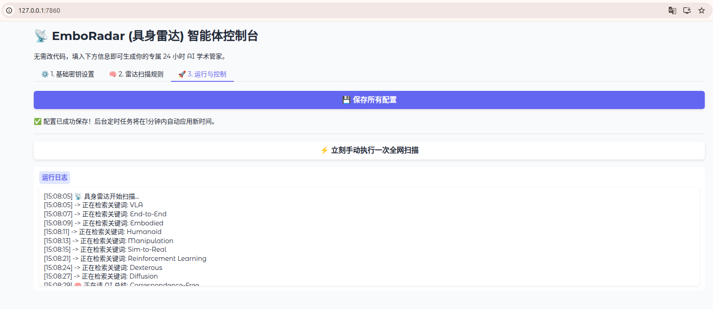
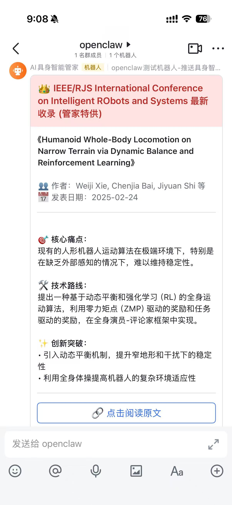

# 📡 EmboRadar (具身雷达) - WebUI 可视化版

[](https://www.python.org/)
[](https://www.gradio.app/)
[](LICENSE)


> **专为具身智能 (Embodied AI) 与机器人学打造的 24 小时 AI 前沿文献探测器。**

告别繁琐的代码配置！EmboRadar 现已全面升级为 **Web 可视化版本**。无论你是否懂编程，只需一键启动，即可通过优雅的网页控制台配置你的专属学术管家。它将 24 小时在后台替你"盯盘"全球顶会，并使用大语言模型（如智谱 GLM-4）将晦涩的英文摘要提炼为极具极客美感的中文硬核卡片，直接推送到你的飞书工作台。

## 📑 目录

- [效果展示 (Demo)](#-效果展示-demo)
- [核心特性](#-核心特性)
- [极速部署指引](#-极速部署指引-小白友好)
  - [基础准备](#1-基础准备)
  - [下载项目](#2-下载项目)
  - [一键启动](#3-一键启动)
  - [网页端配置与运行](#4-网页端配置与运行)
- [常见踩坑与报错排查 (FAQ)]️-常见踩坑与报错排查-faq)
- [架构说明](#️-底层架构说明-geek-only)
- [许可证]((#-许可证)

---

## 📸 效果展示 (Demo)

### 1. 极简 Web 控制台（0 代码配置）

只需在网页上点点点，即可完成所有复杂的 API 和监控规则配置，配置会自动持久化保存。



### 2. 硬核飞书推送（三分段提炼）

强制大模型采用**"🎯核心痛点 ➡️ 🛠️技术路线 ➡️ ✨创新突破"**的三段式结构，直接降维打击传统的水文罗列：



---

## ✨ 核心特性

| 特性 | 描述 |
|:---|:---|
| 🖥️ **全可视化操作** | 引入 Gradio WebUI，无需手动修改 `.env` 或 `yaml`，密钥和业务配置在网页端一键管理。 |
| 📦 **傻瓜式一键部署** | 内置智能启动脚本，自动识别并利用 Conda 创建隔离环境，自动安装依赖，小白零门槛启动。 |
| 🎯 **顶会精准雷达** | 直连 Semantic Scholar API，精准捕捉 CoRL, ICRA, IROS, RSS 等顶级会议的最新发表动态。 |
| 🧠 **冷酷 AI 提炼** | 严苛的 Prompt 约束，彻底干掉大模型"废话前缀"，精准提取论文的痛点与技术路线。 |
| 🗄️ **本地永久去重** | 内置 `history.json` 记忆中枢，看过的论文绝不推第二遍，支持多领域公平抓取（防截断机制）。 |
| ☕ **防焦虑报备机制** | 当全网探测不到新论文时，管家会主动推送灰色的"平安报备"卡片，确认系统存活，缓解信息焦虑。 |

---

## 🚀 极速部署指引（小白友好）

### 1. 基础准备

> **环境要求**：你的电脑上需要安装好 Miniconda 或 Anaconda。

> **密钥准备**：准备好你的 **智谱 API Key**（[免费获取](https://open.bigmodel.cn/)）以及 **飞书群机器人 Webhook 链接**（⚠️ 飞书机器人安全设置请务必包含关键词：**管家**）

### 2. 下载项目

```bash
git clone https://github.com/lwqlight/ScholarClaw
cd ScholarClaw
```

### 3. 一键启动

我们为您准备了全自动的启动脚本，会自动安装所有环境并弹开网页：

**Windows 用户：**
```bash
# 双击运行 start.bat
```

**Mac/Linux/WSL 用户：**
```bash
chmod +x start.sh
./start.sh
```

### 4. 网页端配置与运行

终端运行成功后，浏览器会自动打开 `http://127.0.0.1:7860`。

| 步骤 | 操作 |
|:---|:---|
| ⚙️ **1. 基础密钥设置** | 填入你的 API Key 和飞书链接 |
| 🧠 **2. 雷达扫描规则** | 随心所欲地添加你关心的关键词（如 VLA, Humanoid 等） |
| 💾 **保存配置** | 点击 **【💾 保存所有配置】** |
| ⚡ **立即运行** | 点击 **【⚡ 立刻手动执行一次全网扫描】**，去飞书里验收你的硬核情报卡片！ |

> 💡 **提示**：只要这个黑色终端窗口不关，你的 AI 管家就会根据你设定的时间（如每天 08:30 和 18:30），默默在后台为你搜集顶会情报。

---

## ⚠️ 常见踩坑与报错排查 (FAQ)

### ❌ 报错：`ValueError: Unknown scheme for proxy URL URL('socks://...')`

#### 🔍 原因分析

这是 Python 圈极其经典的"代理刺客"问题。如果你在运行前给终端挂载了 SOCKS 代理（例如使用了 `export all_proxy=socks://...`），由于 Gradio WebUI 底层依赖的现代网络库 `httpx` 默认不兼容 `socks://` 协议，会导致启动瞬间直接崩溃。

#### 🛠️ 解决方案（二选一）

**方案 A：清理终端代理变量**（推荐 & 最简单）

在报错的终端内直接清空代理变量，或者直接新开一个纯净的终端窗口即可：

```bash
unset all_proxy ALL_PROXY http_proxy HTTP_PROXY https_proxy HTTPS_PROXY
```

> 注：如果后续请求 API 出现网络超时，建议改用 HTTP 代理，如 `export http_proxy=http://127.0.0.1:7890`

**方案 B：给 Python 装上"SOCKS 翻译官"**（极客解法）

如果你必须使用 SOCKS 代理，只需在你的 Python/Conda 环境里安装扩展包，给 httpx 强行打通任督二脉：

```bash
pip install "httpx[socks]" pysocks
```

---

## 🛠️ 底层架构说明 (Geek Only)

对于喜欢折腾的开发者，EmboRadar 依然保持了极其优雅的配置解耦架构：

| 文件 | 用途 |
|:---|:---|
| `.env` | 用于存放并隔离你的敏感密钥，已加入 `.gitignore` 防止泄露 |
| `config.yaml` | 业务配置清单，Web 端的所有修改最终会落盘于此 |
| `history.json` | 本地轻量级数据库，记录已推送的论文原始标题 |
| `radar.log` | 物理日志文件，记录管家运行时的全部心跳与动作 |

---

## 📄 许可证

本项目采用 **MIT 许可证**，欢迎自由探索、Fork 与改造！

---

<p align="center">
  <b>如果这个项目对你有帮助，请给个 ⭐ Star 支持一下！</b>
</p>
